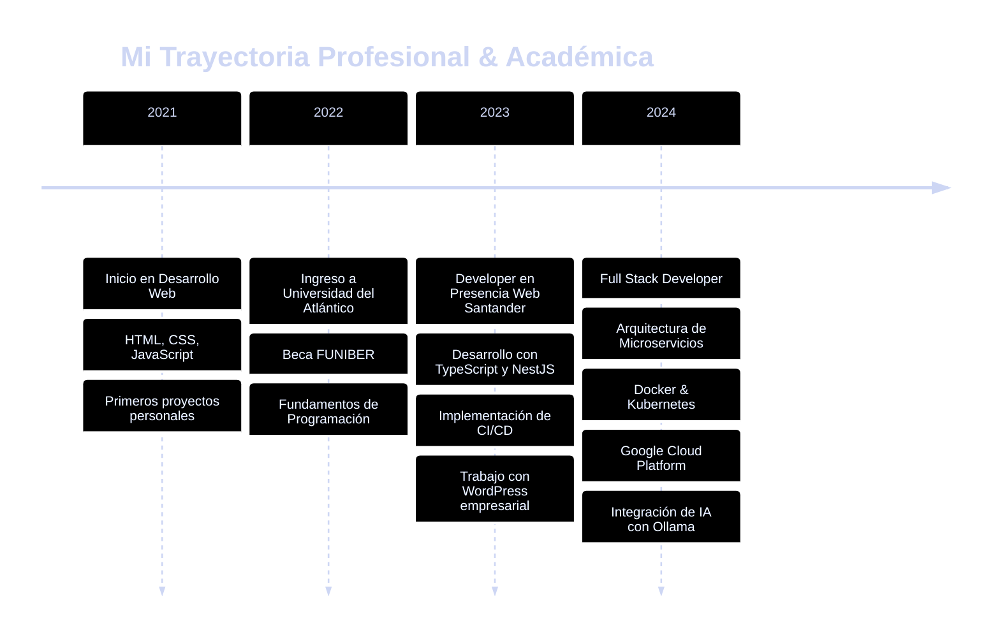

  

  

<!-- Banner SVG Animado con tema Catppuccin -->
<svg width="100%" height="200" xmlns="http://www.w3.org/2000/svg">
  <!-- Removiendo filtro glow que causa problemas de renderizado en GitHub -->
  <defs>
    <linearGradient id="catppuccin-gradient" x1="0%" y1="0%" x2="100%" y2="100%">
      <stop offset="0%" style="stop-color:#89b4fa;stop-opacity:1">
        <animate attributeName="stop-color" values="#89b4fa;#cba6f7;#f38ba8;#89b4fa" dur="8s" repeatCount="indefinite" />
      </stop>
      <stop offset="50%" style="stop-color:#cba6f7;stop-opacity:1">
        <animate attributeName="stop-color" values="#cba6f7;#f38ba8;#fab387;#cba6f7" dur="8s" repeatCount="indefinite" />
      </stop>
      <stop offset="100%" style="stop-color:#f38ba8;stop-opacity:1">
        <animate attributeName="stop-color" values="#f38ba8;#fab387;#89b4fa;#f38ba8" dur="8s" repeatCount="indefinite" />
      </stop>
    </linearGradient>
  </defs>
  
  <!-- Fondo -->
  <rect width="100%" height="200" fill="#1e1e2e" rx="10"/>
  
  <!-- Partículas animadas -->
  <circle cx="10%" cy="50" r="3" fill="#89b4fa" opacity="0.6">
    <animate attributeName="cy" values="50;150;50" dur="4s" repeatCount="indefinite" />
    <animate attributeName="opacity" values="0.6;1;0.6" dur="4s" repeatCount="indefinite" />
  </circle>
  <circle cx="30%" cy="120" r="2" fill="#cba6f7" opacity="0.6">
    <animate attributeName="cy" values="120;60;120" dur="5s" repeatCount="indefinite" />
    <animate attributeName="opacity" values="0.6;1;0.6" dur="5s" repeatCount="indefinite" />
  </circle>
  <circle cx="70%" cy="80" r="2.5" fill="#f38ba8" opacity="0.6">
    <animate attributeName="cy" values="80;140;80" dur="4.5s" repeatCount="indefinite" />
    <animate attributeName="opacity" values="0.6;1;0.6" dur="4.5s" repeatCount="indefinite" />
  </circle>
  <circle cx="90%" cy="140" r="3" fill="#fab387" opacity="0.6">
    <animate attributeName="cy" values="140;70;140" dur="6s" repeatCount="indefinite" />
    <animate attributeName="opacity" values="0.6;1;0.6" dur="6s" repeatCount="indefinite" />
  </circle>
  
  

  
  # ✨ Full Stack Web Developer | Software Engineer ✨

  <!-- Línea decorativa animada -->
 <line x1="20%" y1="160" x2="80%" y2="160" stroke="url(#catppuccin-gradient)" stroke-width="2" stroke-linecap="round">
    <animate attributeName="x1" values="20%;30%;20%" dur="4s" repeatCount="indefinite" />
    <animate attributeName="x2" values="80%;70%;80%" dur="4s" repeatCount="indefinite" />
</svg>

<!-- Typing SVG -->

  

---

## 🪴 Sobre Mí

 

---

## 💻 Tech Stack

### Frontend Development

  
  
  
  
  
  

### Backend Development

  
  
  
  
  
  

### Database & Cache

  
  
  
  

### DevOps & Cloud

  
  
  
  
  
  

### Testing & Tools

  
  
  
  
  
  

### CMS & AI

  
  
  

---

## 🔭 GitHub Stats

  

## 💼 Experiencia Profesional

---

## 🎓 Educación & Certificaciones

<table align="center">
  <tr>
    <td align="center" width="300">
      
      <h3>Universidad del Atlántico</h3>
      
<strong>Ingeniería Informática</strong>

      
Becado FUNIBER

    </td>
    <td align="center" width="300">
      
      <h3>Presencia Web Santander</h3>
      
<strong>Developer Team Member</strong>

      
Desarrollo Web Full Stack

    </td>
  </tr>
</table>

---

## 🚀 Proyectos Destacados

<table>
  <tr>
    <td width="50%">
      <h3 align="center">Sistema de Gestión Empresarial</h3>
      

        
        

          
          
        

        
<strong>NestJS, TypeScript, PostgreSQL, Docker</strong>

        
Sistema completo de gestión con arquitectura de microservicios, autenticación JWT y panel de administración.

      

    </td>
    <td width="50%">
      <h3 align="center">API RESTful con CI/CD</h3>
      

        
        

          
          
        

        
<strong>Express, MongoDB, Jenkins, GitLab CI</strong>

        
API escalable con pipeline de CI/CD automatizado, tests con Jest y despliegue en Google Cloud.

      

    </td>
  </tr>
  <tr>
    <td width="50%">
      <h3 align="center">Dashboard Analytics</h3>
      

        
        

          
          
        

        
<strong>React, TypeScript, Tailwind, Chart.js</strong>

        
Dashboard interactivo con visualización de datos en tiempo real y diseño responsive moderno.

      

    </td>
    <td width="50%">
      <h3 align="center">Automatización con AppScript</h3>
      

        
        

          
        

        
<strong>Google AppScript, Sheets API, Gmail API</strong>

        
Herramientas de automatización para Google Workspace, procesamiento de datos y reportes automáticos.

      

    </td>
  </tr>
</table>

## 💬 Habilidades Blandas

<table>
  <tr>
    <td align="center" width="25%">
      
      
Colaboración efectiva en equipos multidisciplinarios

    </td>
    <td align="center" width="25%">
      
      
Análisis crítico y soluciones creativas

    </td>
    <td align="center" width="25%">
      
      
Documentación clara y comunicación efectiva

    </td>
    <td align="center" width="25%">
      
      
Adaptación constante a nuevas tecnologías

    </td>
  </tr>
</table>

---

## 📫 Conecta Conmigo

---

## 🐢 Profile Views & Stats

  

  

---

## 🌟 Testimonios

> "Alex es un desarrollador excepcional con gran capacidad de aprendizaje y compromiso con la calidad del código."  
> **— Equipo Presencia Web Santander**

> "Su dominio en conocimientos DevOps ha sido fundamental para el éxito de nuestros proyectos."  
> **— Líder Técnico**

---

<!-- SVG Footer animado -->

<svg width="100%" height="120" xmlns="http://www.w3.org/2000/svg">
  <rect width="100%" height="120" fill="#1e1e2e"/>
  
  <!-- Onda animada superior -->
  <path d="M0,40 Q250,20 500,40 T1000,40 T1500,40 T2000,40 T2500,40 T3000,40" stroke="#89b4fa" stroke-width="2" fill="none" opacity="0.3">
    <animate attributeName="d" 
             values="M0,40 Q250,20 500,40 T1000,40 T1500,40 T2000,40 T2500,40 T3000,40;
                     M0,40 Q250,60 500,40 T1000,40 T1500,40 T2000,40 T2500,40 T3000,40;
                     M0,40 Q250,20 500,40 T1000,40 T1500,40 T2000,40 T2500,40 T3000,40"
             dur="5s" 
             repeatCount="indefinite"/>
  </path>
  
  <path d="M0,40 Q250,60 500,40 T1000,40 T1500,40 T2000,40 T2500,40 T3000,40" stroke="#cba6f7" stroke-width="2" fill="none" opacity="0.3">
    <animate attributeName="d" 
             values="M0,40 Q250,60 500,40 T1000,40 T1500,40 T2000,40 T2500,40 T3000,40;
                     M0,40 Q250,20 500,40 T1000,40 T1500,40 T2000,40 T2500,40 T3000,40;
                     M0,40 Q250,60 500,40 T1000,40 T1500,40 T2000,40 T2500,40 T3000,40"
             dur="5s" 
             repeatCount="indefinite"/>
  </path>
  
  <!-- Texto principal -->
  <text x="50%" y="75" font-family="'Courier New', monospace" font-size="16" fill="#cdd6f4" text-anchor="middle" font-weight="bold">
    "Code is poetry, but debugging is horror" 💻
  </text>
  
  <text x="50%" y="95" font-family="'Courier New', monospace" font-size="12" fill="#89b4fa" text-anchor="middle" opacity="0.7">
    Made with 🍒 by Alex Larin | Universidad del Atlántico
  </text>
  
  <!-- Partículas decorativas -->
  <circle cx="15%" cy="60" r="2" fill="#f38ba8" opacity="0.5">
    <animate attributeName="opacity" values="0.5;1;0.5" dur="2s" repeatCount="indefinite" />
  </circle>
  <circle cx="85%" cy="65" r="2" fill="#a6e3a1" opacity="0.5">
    <animate attributeName="opacity" values="0.5;1;0.5" dur="2.5s" repeatCount="indefinite" />
  </circle>
</svg>

---

  

